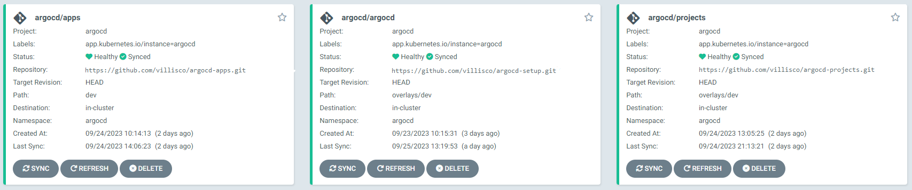
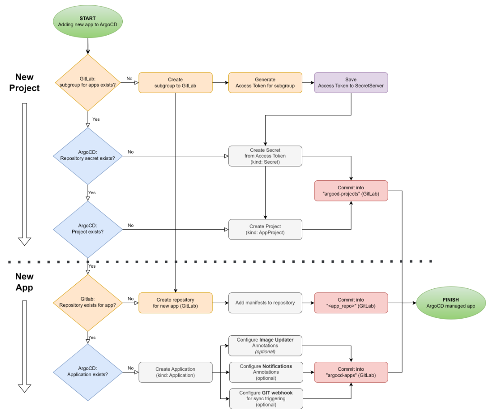

# argocd-setup

This is an __EXAMPLE(!) ArgoCD setup__, extended with user defined configurations.

Custom configurations:

- ArgoCD is configured to use [Keycloak for authentication](https://argo-cd.readthedocs.io/en/stable/operator-manual/user-management/keycloak).
- Feature [Applications in any namespace](https://argo-cd.readthedocs.io/en/stable/operator-manual/app-any-namespace) is enabled in configurations.
- Repository includes 3 "root" apps named __argocd__, __apps__, __projects__ (kind: Application).\
  __argocd__ and __apps__ use the [App of Apps](https://argo-cd.readthedocs.io/en/stable/operator-manual/cluster-bootstrapping) pattern to bootstrap the cluster.

  

__Kustomize__ is used to patch the base files over with environment specific configs.\
For local testing get the kustomize tool from https://kustomize.io

## Linked repositories

Splitting up the repositories provides option to manage permissions separately.

- https://github.com/villisco/argocd-apps - sync source for __apps__ (kind: Application)
- https://github.com/villisco/argocd-projects - sync source for __projects__ (kind: Application)

Process flowchart:\



## Repository structure

```
argocd-setup
├── README.md
├── base
│   ├── /apps                         <!--- root admin apps
│   │   ├── apps.yaml                 <!--- creates app named "argocd" (syncs this repo content)
│   │   ├── projects.yaml             <!--- creates app named "projects" (syncs "argocd-projects" repo content)
│   │   └── argocd.yaml               <!--- creates app named "apps" (syncs "argocd-apps" repo content; "app-of-apps")
│   ├── /configmaps                   <!--- configmaps used by "argocd"
│   ├── /secrets                      <!--- repository login secrets used by apps: "argocd, "apps"
│   ├── /services                     <!--- services configured for "argocd"
│   ├── projects                    
│   │   ├── argocd.yaml               <!--- used by apps: "argocd", "apps"
│   │   └── default.yaml              <!--- restricted version of the default project (override)
│   ├── namespace.yaml
│   └── kustomization.yaml
└── overlays                          
    ├── dev                           <!--- patch the base files with "dev" env conf
    │   ├── /apps
    │   ├── /secrets
    │   ├── argocd-cm.yaml
    │   ├── argocd-cmd-params-cm.yaml
    │   ├── argocd-rbac-cm.yaml       <!--- argocd groups available in keycloak
    │   └── kustomization.yaml
    ├── live
    │   ├── ...
    │   └── kustomization.yaml
    └── test
        ├── ...
        └── kustomization.yaml
```

## Initial setup

When ArgoCD has not yet been installed to cluster use `kubectl` to apply manifests aka install ArgoCD.\
This is default ArgoCD install (github.com manifests) + custom user configurations (from this repo).

__1. Install ArgoCD + AppProjects (projects needed for root applications)__
```
# Match all labels except "kind=Application"
kustomize build . | kubectl apply -l kind!=Application -f -
```

> PS! ArgoCD default install does not create any Applications - they are all user defined (safe to exclude)!

__2. Install the root Applications (argocd,projects,apps)__
```
kustomize build . | kubectl apply -l kind=Application -f -
```

> NB! ArgoCD must be first installed and running before adding the applications (__kind: Application__) custom resources !
